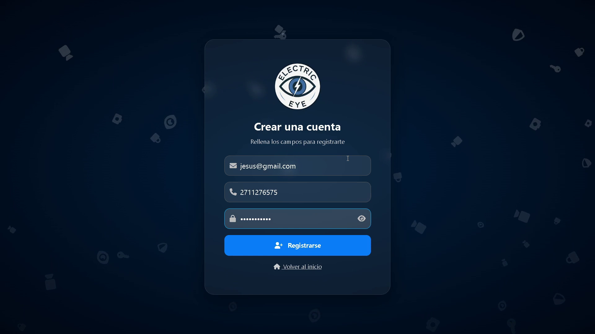
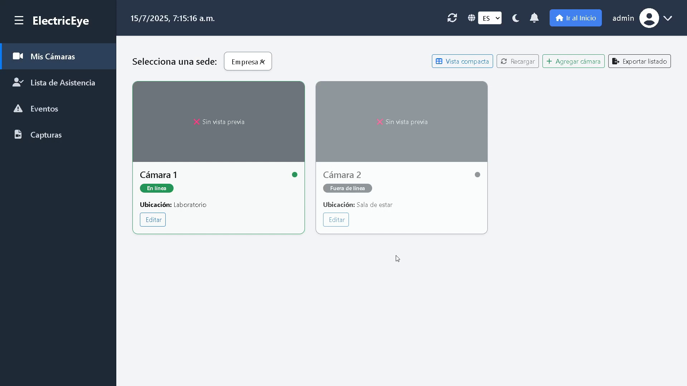
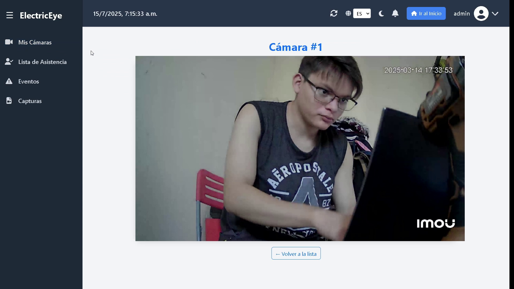

# 🔒 Electri‑Eye – Sistema de Vigilancia Inteligente

[](https://nodejs.org/)
[](https://angular.io/)
[](https://www.mongodb.com/)
[](https://www.gnu.org/licenses/agpl-3.0)

**Electri‑Eye** es una aplicación para **monitoreo inteligente** con autenticación de usuarios, gestión de cámaras y control de accesos. El proyecto está dividido en dos partes:
- 📡 **Backend**: API RESTful en **Node.js/Express**, integrando **MongoDB**.
- 🎨 **Frontend**: SPA en **Angular** con interfaz moderna y responsive.

---

## 🚀 Características
- Autenticación con roles (JWT).
- Gestión de usuarios y cámaras.
- Módulos de reconocimiento/registro de rostros.
- Panel administrativo y vistas de monitoreo.
- Arquitectura **Frontend + Backend** desacoplada.

---

## 🛠️ Tecnologías
**Backend**: Node.js, Express, MongoDB/Mongoose, JWT, dotenv

**Frontend**: Angular, TypeScript, HTML5, CSS

**DevOps**: Git & GitHub (Actions opcional), Docker (opcional)

---

## 📂 Estructura
```
Electri-Eye/
├── Backend/
│   ├── controllers/
│   ├── middlewares/
│   ├── models/
│   ├── routes/
│   ├── utils/
│   └── server.js
└── Frontend/
    ├── src/
    ├── public/
    ├── angular.json
    └── package.json
```

---

## ⚙️ Configuración rápida
### 1) Variables de entorno (Backend)
Crea `Backend/.env` con valores como:
```
PORT=3000
MONGO_URI=mongodb://localhost:27017/electri-eye
JWT_SECRET=pon_aqui_un_secreto_seguro
```

### 2) Instalar y correr
**Backend**
```
cd Backend
npm install
npm start
```

**Frontend**
```
cd Frontend
npm install
ng serve -o
```

---

## 🔗 Endpoints (ejemplos)
> Ajusta según tus rutas reales.

- `POST /api/auth/login` – Autenticación
- `POST /api/auth/register` – Registro de usuario
- `GET  /api/users` – Lista de usuarios (admin)
- `GET  /api/rostros` – Gestión/consulta de rostros

---

## 📸 Capturas
Guarda las imágenes en `./screenshots` y referéncialas así:

- 
- 
- 

---

## 🤝 Contribución
1. Fork del repo
2. Crea una rama: `git checkout -b feature/mi-feature`
3. Commit: `git commit -m "feat: agrega mi feature"`
4. Push: `git push origin feature/mi-feature`
5. Abre un Pull Request

---

## 🗺️ Roadmap (ideas)
- [ ] CI/CD con GitHub Actions
- [ ] Docker Compose para dev (API + DB + Front)
- [ ] Tests (Jest / Karma)
- [ ] Monitoreo y métricas
